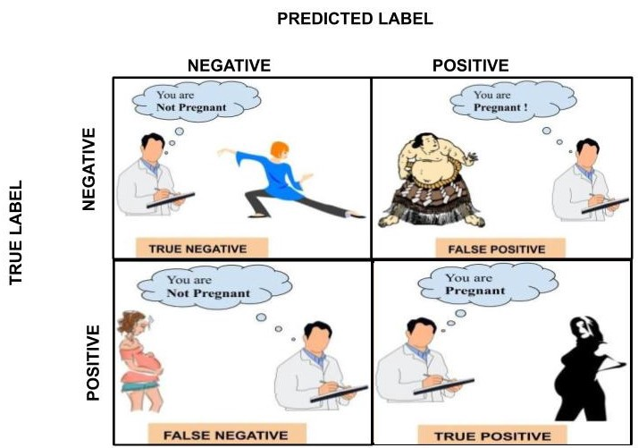
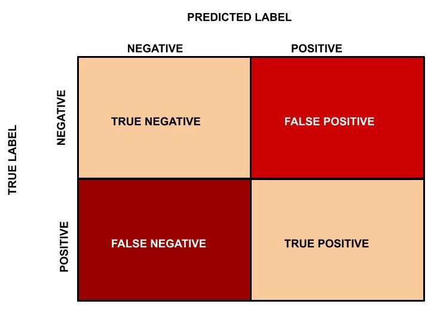

# Accuracy measures and classification models

Just like we know there are two types of supervised learning, there are different metrics that apply to the cases of Classification and Regression. In both cases, metrics utilize the fact that in supervised learning we have a test set against which we can compare the predicted values from our algorithm with the true outcome values.

## Measures of Accuracy for Classification Models

### 1. Confusion Matrix

Link: https://medium.com/analytics-vidhya/confusion-matrix-accuracy-precision-recall-f1-score-ade299cf63cd

Four important numbers of the confusion matrix:

- True Positive
- True Negative
- False Positive
- False Negatives

The above diagram is for binary classification problems. For multi-class classification, a similar *n x n* table of accurately and incorrectly predicted values can be constructed for a classification of *n* classes.

**Accuracy/classification rate** is one of the most commonly used metrics. It is also one of the most general, as it is simply the **ratio of total correct predictions to the total number of predictions made** (in our case, the size of the test set).

_Sensitivity_: True positive recognition rate (TP/P)

_Specificity_: True negative recognition rate (TN/N)

Two metrics that are commonly addressed together are **recall and precision**.

- **Precision, also called positive predictive value, is the total number of true positives divided by all those values we predicted to be positive (the sum of true positives and false positives).** Precision measures what percentage of your predictions are actually relevant - where the positive class is correctly predicted. This metric is particularly important in cases where the cost of being wrong in a positive prediction is particularly high. For example, the Indian penal system is based on the concept of achieving as high precision as possible, as summed up in the maxim _"Let a hundred guilty be acquitted but one innocent should not be convicted"_.

- **Recall, also called sensitivity or the true positive rate, is the number of true positives divided by all those results whose true value belongs to the positive class (the sum of true positives and false negatives).** Intuitively, recall is the number of relevant items that were correctly identified. Recall is an especially important metric in situations where the cost of incorrect negative classification is high.

**F measure (F1 or F-score)**: harmonic mean of precision and recall

### 2. AUC-ROC (Area Under the Curve - Receiver Operating Characteristics)

The AUC-ROC measures performance by calculating the area under the curve created by plotting these two values against each other, and is bounded between 0 and 1.

- Originated from signal detection theory
- Shows the trade-off between the true positive rate and the false positive rate
- Area under the curve: the closer to the diagonal line (i.e., the closer the area is to 0.5), the less accurate is the model

When the AUC - ROC (the area under the curve) is equal to 1, this is perfect performance (and the best-case scenario!) but is also highly unlikely. In most common cases, the AUC is some number between .5 and 1, indicating the algorithm is doing better than random chance (which would be .5) but not perfectly (which would be 1 as we have seen in the last example). The AUC number is interpretable as the percentage chance that the model will correctly distinguish between the classes. For example, the above curve could have an AUC-ROC of .87, meaning that the model from which it was drawn has an 87% chance of correctly distinguishing between the two classes when it is asked to predict the class of new data. The closer to 1, the better the algorithm's ability to distinguish between the two classes. Also the AUC of zero means that the algorithm is predicting perfectly incorrectly-- it predicts the inverse of the correct class every time. It is nearly impossible to see this in practice unless there is a mistake in the code.

Note:

TPR = Sensitivity (TP/P)
FPR = 1 – Specificity (FP/N)

Plotting an ROC AUC curve:

For different values of threshold the number of TP , TN, FP and FN are calculated. This gives a value of TPR and FPR. Lets say that for different values of thresholds, we get the following table:

